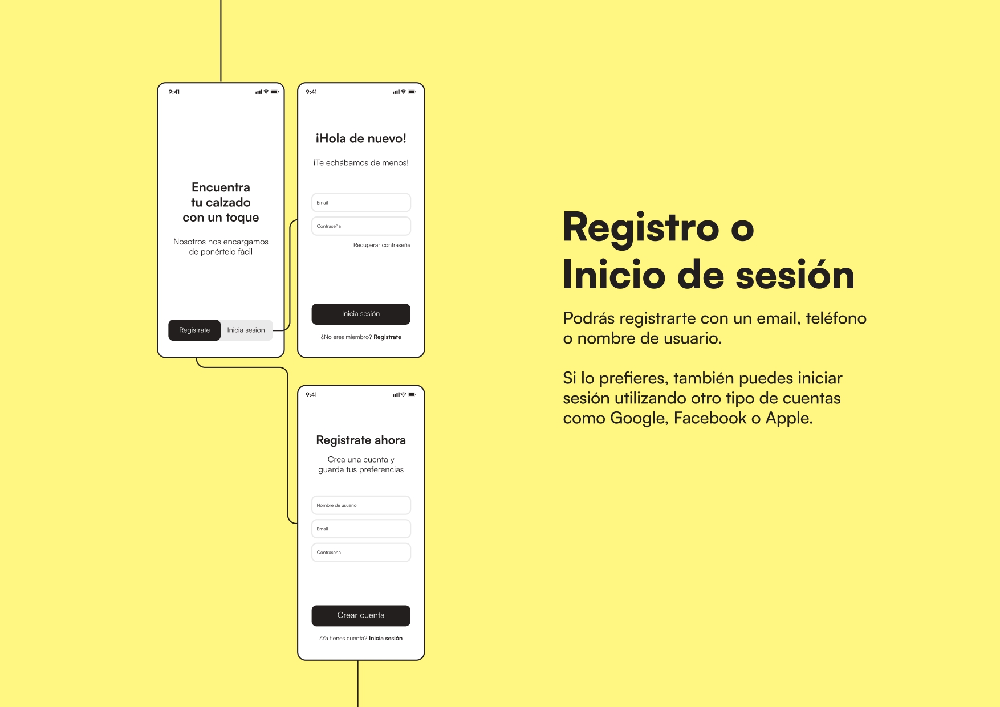
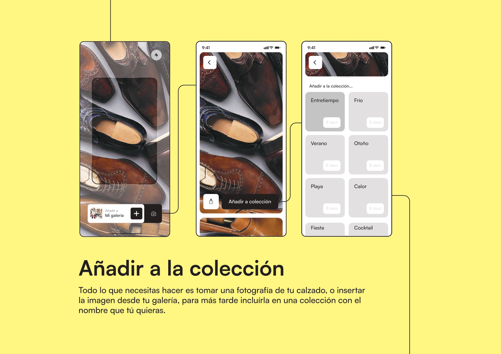
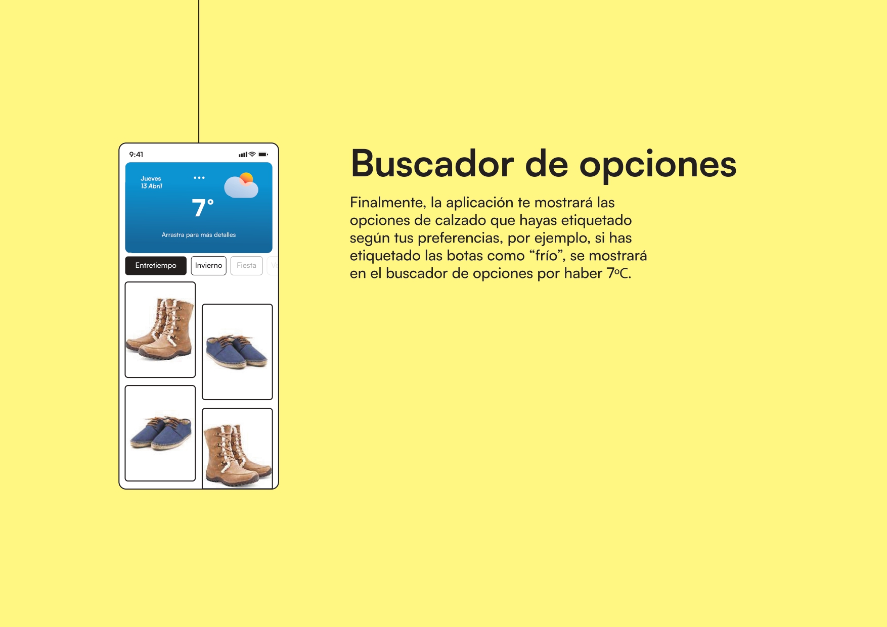

<<<<<<< HEAD
## __Título
App para saber qué calzado utilizar según el tiempo que haga.

## __Descripción
Para utilizar está app será necesario registrarse. Una vez el usuario cree una cuenta, este tendrá que crear su propia librería de calzado utilizando para ello fotografías de su calzado y etiquetándolo para que, más adelante, según el tiempo que haga ese día pueda elegir entre varias opciones que proporcione la app. Por ejemplo, una vez haya subido una foto de unas botas y etiqueado como "frío, lluvia, invierno, otoño", los días que llueva mostrarán esas botas como una opción.

## __Necesidad que soluciona
Esta aplicación te ahorrará tiempo, evitará ese rato parado delante del zapatero, sin poder ver todos los zapatos que tienes, para tomar la decisión de qué ponerte.

## __Target
Personas, independientemente de su sexo, de entre 25 y 60 años con un nivel económico medio y medio-alto.

## __Mockups

## __MVP
Funcionalidades mínimas para el funcionamiento de la aplicación:
  - Registro de usuario
  - Importación de imágenes a la biblioteca
  - Etiquetado de imágenes
=======
## __Título
App para saber qué calzado utilizar según el tiempo que haga.

## __Descripción
Para utilizar está app será necesario registrarse. Una vez el usuario cree una cuenta, este tendrá que crear su propia librería de calzado utilizando para ello fotografías de su calzado y etiquetándolo para que, más adelante, según el tiempo que haga ese día pueda elegir entre varias opciones que proporcione la app. Por ejemplo, una vez haya subido una foto de unas botas y etiqueado como "frío, lluvia, invierno, otoño", los días que llueva mostrarán esas botas como una opción.

## __Necesidad que soluciona
Esta aplicación te ahorrará tiempo, evitará ese rato parado delante del zapatero, sin poder ver todos los zapatos que tienes, para tomar la decisión de qué ponerte.

## __Target
Personas, independientemente de su sexo, de entre 25 y 60 años con un nivel económico medio y medio-alto.

## __Mockups

## __MVP
Funcionalidades mínimas para el funcionamiento de la aplicación:
  - Registro de usuario
  - Importación de imágenes a la biblioteca
  - Etiquetado de imágenes
>>>>>>> b61fd0cd2c053442e03d010ed8c35833572726e5
  - Vinculación de aplicación del tiempo